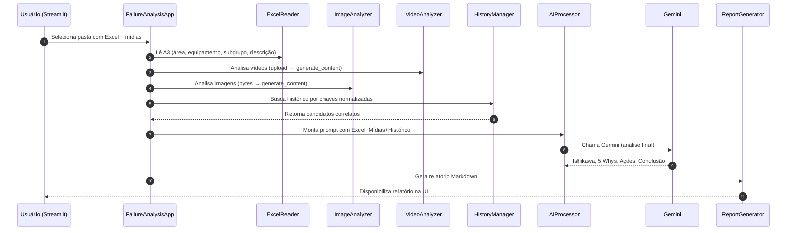
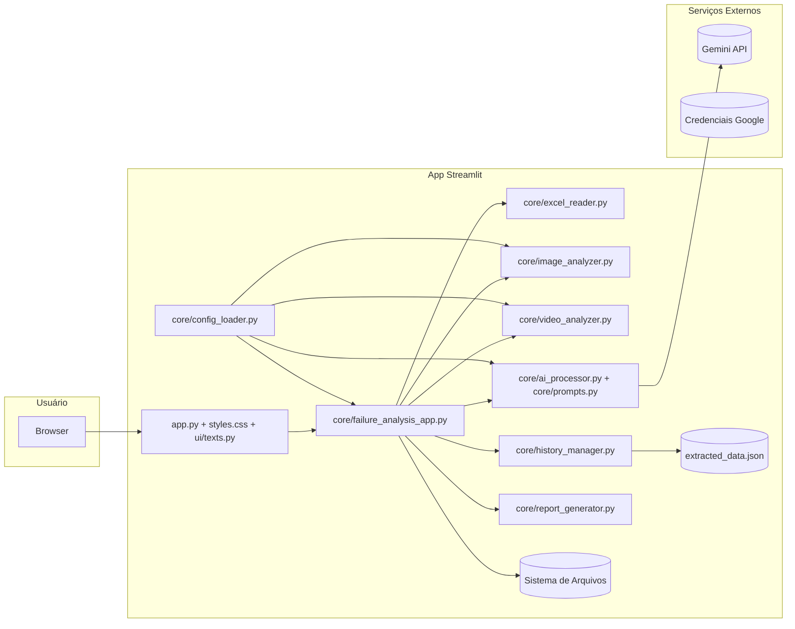

## ⚙ Sistema Inteligente de Análise de Causa Raiz (RCA) com IA
  Este projeto é um aplicativo web construído com Streamlit e Python, projetado para automatizar e aprimorar o processo de Análise de Causa Raiz (RCA) em falhas de equipamentos industriais.
    
  A aplicação utiliza o poder de modelos de linguagem de última geração para analisar dados multimodais (textos, imagens e vídeos) e gerar relatórios técnicos estruturados, entregando agilidade, rastreabilidade e inteligência ao processo de manutenção.


---
## 🎥 Assista à demonstração no Vimeo


[](https://player.vimeo.com/video/1115514946?h=1258ba6fe4)


---
## 📸 Interface do Sistema

 

---

  ##   [Confira o resultado obtido com dados ficticios PT](Resultado_Bomba_BC_14_PT.md)

  ##   [Confira o resultado obtido com dados ficticios EN](Resultado_Bomba_BC_14_EN.md)
  


---


## ✨ Funcionalidades Principais

   Análise Multimodal: Combina dados de diferentes origens para enriquecer o contexto:
   
   Arquivos Excel (.xlsx): Extração automática de área, equipamento, subgrupo e descrição curta do problema.
   
   Imagens e Vídeos: Análise visual com IA para detecção de evidências e anomalias.


 Inteligência Estruturada por 4 Pilares:

   1. Coleta de Dados: Importação de dados  em planilhas, imagens e vídeos em um fluxo único.


   2. Análise de Mídias: Interpretação automática de imagens e vídeos, convertendo evidências visuais em descrições técnicas.


   3. Busca no Histórico (RAG de Dois Estágios):

   Filtragem inicial por área, equipamento e subgrupo.

   Seleção refinada das 3 falhas históricas mais relevantes para o contexto atual.


   4. Análise Integrada com IA: Consolidação de todas as informações coletadas para gerar uma análise final contextualizada.


--- 

## 📑Geração Automática de Relatórios Técnicos:

   Estruturação em Markdown (.md), pronto para consulta e compartilhamento.
    
   Inclusão das principais ferramentas de RCA:
    
       ✅ 5 Porquês
    
       ✅ Diagrama de Ishikawa (6M)
    
       ✅ Plano de Ação
    
       ✅ Conclusão Final
   
   Possibilidade de exportar o histórico bruto para análises adicionais manuais.

---

## 🧲 Correlação com Histórico de Falhas:

   O sistema compara a falha atual com registros passados, identificando rapidamente ocorrências semelhantes.
    
   Permite consumir a inteligência acumulada da fábrica, aproveitando o conhecimento de engenheiros e técnicos ao longo de várias análises.
    
    
   Interface Intuitiva: Construída com Streamlit, priorizando simplicidade e acessibilidade, sem abrir mão de recursos avançados.
    
   Suporte a Múltiplos Idiomas: Relatórios e interface disponíveis em Português e Inglês.


---

## ⚙ Fluxo de Funcionamento

 O aplicativo segue um pipeline inteligente, integrando todas as etapas da análise:
     
   1. Seleção da Pasta: O usuário escolhe o diretório contendo os arquivos de entrada (.xlsx, imagens e vídeos).
     
     
   2. Coleta de Dados Estruturados: O sistema lê e organiza os dados básicos da falha.
     
     
   3. Análise de Mídias: Evidências visuais são processadas e descritas em linguagem técnica.
     
     
   4. Busca e Refinamento no Histórico (RAG):
     
         O banco de dados extracted_data.json é filtrado por critérios técnicos.
         
         Em seguida, um estágio semântico seleciona os 3 casos mais relevantes.
     
     
     
   5. Análise Final com IA: Integra todas as informações (planilhas + mídias + histórico) e gera um diagnóstico estruturado.
     
     
   6. Geração de Relatório: Produção de um arquivo .md com toda a análise, pronto para download e uso.


---

## 📝 Logging e Auditoria

 Todos os prompts finais enviados para a IA são registrados em logs/, incluindo:
 
   Pasta processada
     
   Data e hora
     
   Quantidade de tokens
     
   Histórico refinado incluído
 
 
 
 Isso garante rastreabilidade total do processo de análise.

---


# 📐 Arquitetura do Sistema — Análise de Falhas (RCA com IA)


---

## ⚙️ Visão Geral (Camadas)

- **Apresentação (UI):**
  - `app.py` — interface em **Streamlit**.
  - `ui/texts.py` — textos bilíngues (PT/EN).
  - `styles.css` — estilos customizados.

- **Aplicação (Orquestração):**
  - `core/failure_analysis_app.py` — coordena o pipeline: Excel → Mídias → Histórico (RAG) → IA → Relatório.

- **Serviços de Domínio:**
  - `core/excel_reader.py` — leitura da aba Excel.
  - `core/image_analyzer.py` — análise técnica de **imagens** (Gemini).
  - `core/video_analyzer.py` — análise técnica de **vídeos** (Gemini).
  - `core/ai_processor.py` — prompts, chamada ao Gemini e parsing (Ishikawa/5 Whys).
  - `core/history_manager.py` — RAG (match por Área/Equipamento/Subgrupo + refinamento semântico).
  - `core/report_generator.py` — relatório final em Markdown.
  - `core/prompts.py` — templates de prompts e formatação.

- **Infraestrutura & Config:**
  - `core/config_loader.py` — leitura de `config.json` (API keys/paths).
  - `extracted_data.json` — base histórica (entrada do RAG).
  - `logs/` — registro de prompts enviados.
  - `relatorios/` — saída dos relatórios `.md`.

---

## 🗂 Estrutura de Pastas

```
project/
│── app.py
│── styles.css
│── config.json
│── extracted_data.json
│
├── ui/
│   └── texts.py
│
├── core/
│   ├── failure_analysis_app.py
│   ├── excel_reader.py
│   ├── image_analyzer.py
│   ├── video_analyzer.py
│   ├── ai_processor.py
│   ├── history_manager.py
│   ├── report_generator.py
│   └── prompts.py
│
├── logs/
└── relatorios/
```

---

## 🔄 Fluxo de Processamento (Sequência)



---

## 🧩 Diagrama de Containers (C4 — Nível 2)



---

## 🧠 Contratos de Dados (principais I/O)

### 1) Saída do `ExcelReader.read_excel()`
```json
{
  "status": "success",
  "data": {
    "area": "Manutenção",
    "equipment": "Bomba 14",
    "subgroup": "Hidráulico",
    "description": "Perda de pressão e vazamento..."
  }
}
```

### 2) `AIProcessor.process_with_gemini()` (resumo)
```json
{
  "raw_response": "<markdown do LLM>",
  "ishikawa": {"causes": { "Material": ["...","..."], "Máquina": ["...","..."] }},
  "five_whys": ["Por que ...? ...", "..."],
  "action_plan": ["...", "...", "..."],
  "conclusion": "Texto final",
  "token_details": { "input_tokens": 0, "output_tokens": 0, "total_tokens": 0 }
}
```

### 3) Resultado agregado por pasta (em `FailureAnalysisApp.process_folder`)
```json
{
  "folder": "pasta_caso_x",
  "status": "success",
  "details": {
    "excel_data": { "...": "..." },
    "image_results": "markdown",
    "video_results": "markdown",
    "ai_results": { "...": "..." },
    "broad_history_found": [{ "...": "..." }],
    "refined_history": "markdown"
  },
  "token_details": {
    "media_tokens": 0,
    "media_output_tokens": 0,
    "history_input_tokens": 0,
    "history_output_tokens": 0,
    "history_total": 0,
    "prompt_tokens": 0,
    "response_tokens": 0,
    "total": 0
  }
}
```

---

## 🛠 Tecnologias Utilizadas

   Python 3.9+
    
   Streamlit → Interface Web
    
   Google Gemini (2.5 Pro & Flash) → Análise de texto, imagem e vídeo
    
   Openpyxl → Leitura de planilhas Excel
    
   Unidecode → Normalização de texto para busca em histórico
    
   Matplotlib → Geração do diagrama de Ishikawa
    
   Logging → Auditoria e rastreabilidade
    
   CSS customizado → Interface aprimorada


---

## 💡 Diferenciais

   Integração de dados estruturados (Excel, histórico) e não estruturados (imagens, vídeos).
    
   Arquitetura baseada em 4 pilares que refletem o ciclo completo da análise de falha.
    
   Baixo custo por análise, tornando o sistema acessível para aplicações em escala.
    
   Capacidade de valorizar o conhecimento acumulado da fábrica, reaproveitando análises passadas como insumo para analise de novas falhas.
    
   Flexibilidade: funciona tanto em ambiente de testes (com dados fictícios) quanto em casos reais, mantendo confiabilidade.
    
   Exportação rastreável com relatórios versionados por data e hora.
   


---


